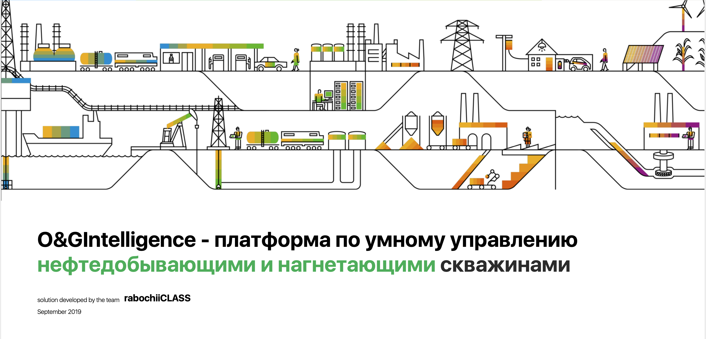
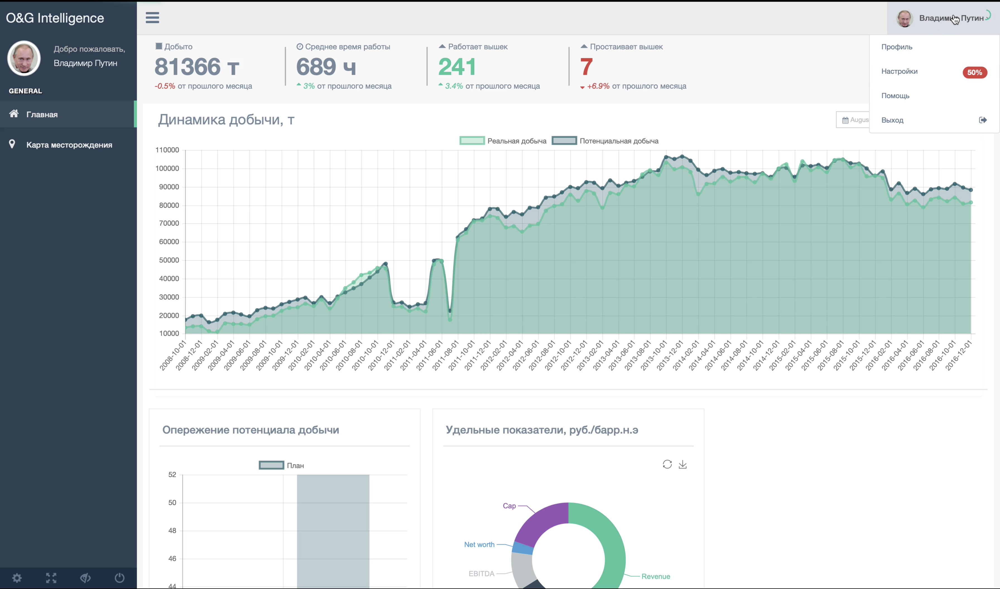
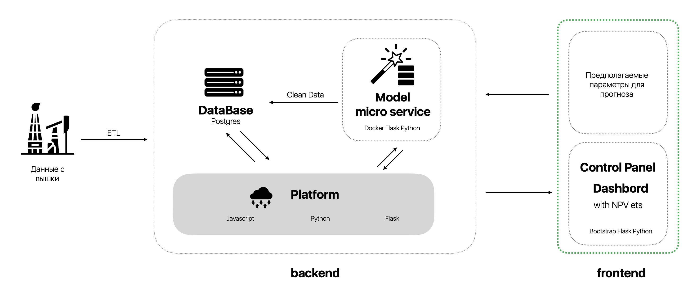

# 3rd place solution - CET-MIPT Hack

CET-MIPT is a Data Science hackathon in application for Oil & Gas industry, hosted
by Boston Consulting Group and Gazprom.

### Context:
In O&G industry, when it comes to oil upstream, there are several problems, such as:
1. Technological backwardness and inefficient use of modern technologies.
2. Organizational and managerial problems caused by the human factor.

### Initiatives:
1. Extract and use data from oil rigs.
2. Train ML model which helps to optimize oil upstream
3. Create a service which reduces human factor and improves overall efficiency
of oil upstream

### Results:
1. Service which shows current upstream NPV and its prediction for a next
period. 
2. Interactive real-time map with actual state of upstream, which
improves decision making process.
3. 6% potential NPV growth.

### Service architecture:

